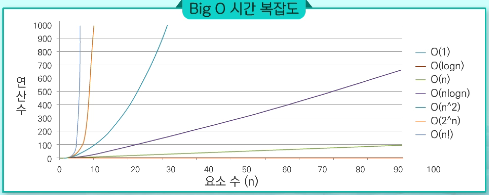
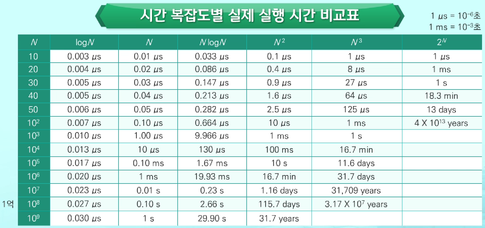
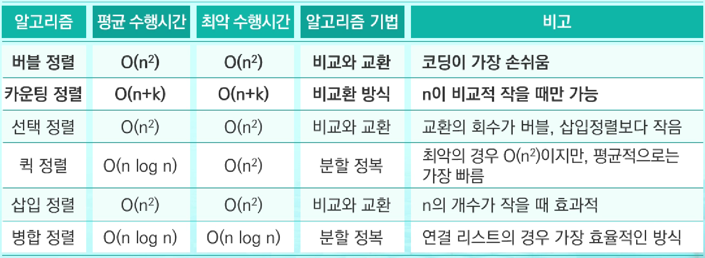
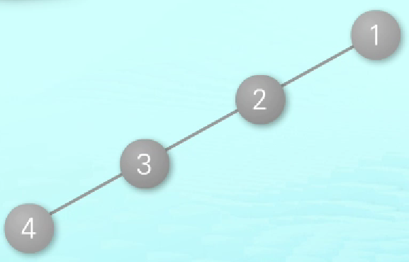
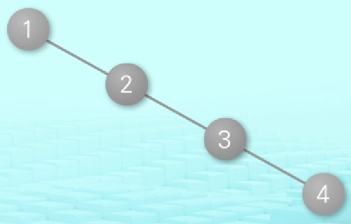
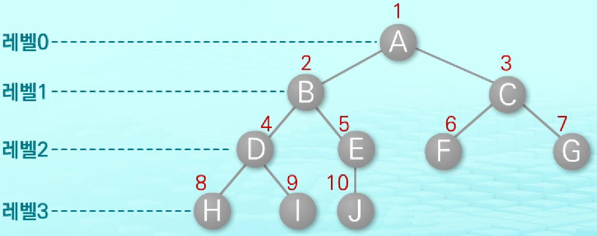

[TOC]

# 알고리즘

유한한 단계를 통해 문제를 해결하기 위한 절차/방법

컴퓨터용어로 쓰이며, 컴퓨터가 어떤 일을 수행하기 위한 단계적 방법

어떠한 문제를 해결하기 위한 절차

- 표현법

  - 슈도코드

    특정 프로그래밍 언어의 문법을 따라 쓰여진 것이 아니라, 일반적인 언어로 코드를 흉내 내어 알고리즘을 써 놓은 코드

    - 특징
      - 의사 코드로 흉내만 내는 코드
      - 실제적인 프로그래밍 언어로 작성된 코드처럼 컴퓨터에서 실행 X
      - 특정 언어로 프로그램을 작성하기 전에 알고리즘을 대략적으로 모델링

  - 순서도

    프로그램/작업의 진행 흐름을 순서에 따라 여러 가지 기호/문자로 나타낸 도표

    - 특징
      - 흐름도, 프로그램의 논리적인 흐름, 데이터의 처리 과정을 표현하는 데 사용
      - 프로그램을 작성하기 전에 프로그램의 전체적인 흐름과 과정 파악을 위해 필수적으로 거처야 되는 작업

- 성능 분석

  - 정확성 : 얼마나 정확하게 동작하는가?

  - 작업량 : 얼마나 적은 연산으로 원하는 결과를 얻어내는가?

    - 계산 방법
      - 실제 걸리는 시간 측정
      - **실행되는 명령문의 개수 계산**

    > **시간복잡도 ≒ 빅-오(O) 표기법**
    >
    > 시간 복잡도 함수 중에서 가장 큰 영향력을 주는 n에 대한 항만을 표시
    >
    > 계수는 생략하여 표시
    >
    > 
    >
    > 

  - 메모리 사용량 : 얼마나 적은 메모리를 사용하는가?

  - 단순성 : 얼마나 단순한가?

  - 최적성 : 더 이상 개선할 여지 없이 최적화되었는가?

## 검색(Search)

저장되어 있는 자료 중에서 원하는 항목을 찾는 작업

> **원하는 항목** : 목적하는 탐색키를 가진 항목
>
> **탐색키(Search Key)** : 자료를 구별하여 인식할 수 있는 키

### 순차 검색(Sequential Search) `O(n)`

일렬로 되어 있는 자료를 순서대로 검색하는 방법

- 특징

  - 리스트/연결 리스트 등 순차구조로 구현된 자료구조에서 유용

- 장점

  - 구현이 쉬움

- 단점

  - 검색 대상이 많은 경우 수행시간 ↑ → 비효율적

- 종류

  - **정렬되지 않은 경우**

    - 수행 과정

      1. 첫번째 원소부터 순서대로 검색대상과 키 값이 같은 원소가 있는지를 비교

      2. 키 값이 동일한 원소를 찾으면 그 원소의 인덱스 반환

      3. 자료구조의 마지막에 갈 때까지 검색 대상을 찾지 못하면 검색 실패

    - 평균 비교 횟수 : 1/n(1+2+3+...+n) = `(n+1)/2`

    - 시간 복잡도 : `O(n)`

  - **정렬된 경우**

    - 수행 과정

      1. 자료가 오름차순으로 정렬된 상태에서 검색을 실시한다고 가정

      2. 순차적으로 검색하면서 키 값 비교

      3. 원소의 키 값이 검색 대상의 값보다 크면 원소가 없다는 것이므로 검색 종료

    - 평균 비교 회수 : 정렬되어 있으므로, 검색 실패를 반환하는 경우 반으로 줄어듬

    - 시간 복잡도 : `O(n)`

```python
arr = [...]
key = ★

# [정렬되지 않은 경우]
for i in range(len(arr)):
    if arr[i] == key:	# 발견
        break
        
# [정렬된 경우]    
for i in range(len(arr)):
    if arr[i] == key:	# 검색 성공
        break
    if arr[i] > key:	# 검색 실패
        break
```

### 이진 검색(Binary Search) `O(log n)`

자료의 가운데 항목의 키 값과 비교하여 다음 검색의 위치를 결정하고 검색을 계속하는 방법

- 특징

  - 검색 범위의 시작점과 종료점을 이용하여 검색을 반복 수행
  - 항상 정렬된 상태의 자료 필요 (자료 삽입/삭제 시 정렬 상태로 유지하는 추가 작업 필요)

- 장점

  - 효율적
  - 빠름
    - 목적키를 찾을 때까지 이진 검색을 순환적으로 반복 수행
    - 검색 범위를 반으로 줄여가면서 수행

- 수행 과정

  1. 자료의 중앙에 있는 원소 선택

  2. 중앙 원소 값과 찾고자 하는 목표 값 비교

  3. 비교 결과에 따라 새로 검색 수행

     - 목표값 < 중앙 원소 값 : 자료의 왼쪽 반에 대해서 새로 검색 수행

     - 목표값 > 중앙 원소 값 : 자료의 오른쪽 반에 대해서 새로 검색 수행

  4. 찾고자 하는 값을 찾을 때까지 반복

```python
arr = [...]
key = ★

# [while]
left = 0
right = len(arr) - 1
while left <= right:
    mid = (left + right) // 2
    if mid == key:	# 검색 성공
        break
    elif mid > key:
        right = mid - 1
    else:
        left = mid + 1
        
# [재귀]
def recur(arr, l, r, k):
    if l > r:		# 검색 실패
        return
    else:
        mid = (l + r) // 2
        if arr[mid] == k:	# 검색 성공
            return
        elif arr[mid] > k:
            recur(arr, l, mid-1, k)
        else:
            recur(arr, mid+1, r, k)

left = 0
right = len(arr) - 1

recur(arr, left, right, key)
```

### 인덱싱(Indexing)

데이터베이스(Database)에서 유래, 테이블에 대한 동작 속도를 높임

룩 업 테이블(Look up table) 등의 용어로 사용

- 장점
  - 인덱스를 저장하는데 필요한 디스크 공간은 보통 테이블 저장에 필요한 디스크 공간보다 작음
    - 인덱스는 키-필드만 갖고 있고, 테이블의 다른 세부 항목은 갖고 있지 않음
  - List를 사용한 인덱스
    - 대량의 데이터를 매번 정렬하면, 프로그램의 반응은 느려질 수 밖에 없음
    - 대량 데이터의 성능 저하 문제를 해결하기 위해 List 인덱스 사용 가능

### 이진 탐색 트리(BST : Binary Search Tree) `O(log n)`

탐색작업을 효율적으로 하기 위한 자료구조

- 특징

  - 모든 원소는 서로 다른 유일한 키를 가짐
  - key (왼쪽 서브트리) < key (루트 노드) < key (오른쪽 서브트리)
  - 왼쪽 서브트리와 오른쪽 서브트리도 이진 탐색 트리
  - 중위 순회하면 오름차순으로 정렬된 값 얻을 수 있음

- 연산

  - 탐색(searching)

    1. 루트에서 시작

    2. 탐색할 키값 x를 루트 노드 키값과 비교

       - 키값 x = 루트 노드 키값

         탐색 연산 성공

       - 키값 x < 루트 노드 키값

         루트 노드의 왼쪽 서브트리에 대해 탐색 연산 수행

       - 키값 x > 루트 노드 키값

         루트 노드의 오른쪽 서브트리에 대해 탐색 연산 수행

    3. 서브트리에 대해 순환적으로 탐색 연산 반복

  - 삽입(insertion)

    1. 탐색 연산 수행
       - 삽입할 원소와 같은 원소가 이미 있는지 확인
    2. 탐색 실패한 위치에 원소 삽입

  - 삭제(deletion)

- 성능

  연산 시간은 트리의 높이에 좌우 `O(h)`

  - 평균 `O(log n)`

    이진 트리가 균형적인 경우

  - 최악 `O(n)`

    한쪽으로 치우친 경사 이진 트리의 경우


## 완전 검색(Exhaustive Search) = Brute-force = Generate-and-Test 기법

문제의 해법으로 생각할 수 있는 모든 경우의 수를 나열해보고 확인하는 기법

- 특징
  - 모든 경우의 수를 테스트한 후, 최종 해법을 도출
  - 일반적으로 경우의 수가 상대적으로 작을 때 유용
  - 주어진 문제를 풀 때, 우선 완전 검색으로 접근하여 해답을 도출한 후, 성능 개선을 위해 다른 알고리즘을 사용하고 해답을 확인하는 것이 바람직함
- 장점
  - 해답을 찾아낼 확률 ↑
- 단점
  - 모든 경우의 수를 생성하고 테스트하기 때문에 수행 속도 ↓

### 순열(Permutation) `nPr`

서로 다른 것들 중 몇 개를 뽑아서 한 줄로 나열하는 것

`nPr = n * (n-1) * (n-2) * ... * (n-r+1)`

`nPn = n!`

### 부분 집합

- 수

  원소 n개

  - 공집합 O `2^n`
  - 공집합 X `2^n-1`

```python
arr = [1, 2, 3, 4]

# [Loop]
bit = [0, 0, 0, 0]  	# 대상 List의 각 원소를 포함할지 말지를 정하는 List
for i in range(2):
    bit[0] = i				# 0번째 원소
    for j in range(2):
        bit[1] = j			# 1번째 원소
        for k in range(2):
            bit[2] = k		# 2번째 원소
            for l in range(2):
                bit[3] = l	# 3번째 원소
                print(bit)
                
# [비트 연산]
for i in range(1<<len(arr)):	# 1<<len(arr) : 부분 집합의 개수
    for j in range(len(arr)):	# 원소의 수만큼 비트를 비교
        if i & (1<<j):			# i의 j번째 비트가 1이면 j번째 원소 출력
            print(arr[j], end=' ')
    print()
```

#### 비트 연산자

0과 1로 이루어진 이진수에 대한 연산을 수행하는 연산자

| 종류 |                   설명                   |
| :--: | :--------------------------------------: |
| `&`  |        비트 단위로 AND 연산을 함         |
| `|`  |         비트 단위로 OR 연산을 함         |
| `<<` |  피연산자의 비트 열을 왼쪽으로 이동시킴  |
| `>>` | 피연산자의 비트 열을 오른쪽으로 이동시킴 |


## 탐욕 알고리즘(Greedy Algorithm)

최적해를 구하는데 사용되는 근시안적인 방법

- 특징
  - 여러 경우 중 하나를 결정해야 할 때마다 그 순간에 최적이라고 생각되는 것을 선택해 나가는 방식으로 진행하여 최종적인 해답에 도달
  - 일반적으로, 머리속에 떠오르는 생각을 검증 없이 바로 구현하면 Greedy 접근
- 단점
  - 각 선택의 시점에서 이루어지는 결정은 지역적으로는 최적이지만, 그것들을 계속 수집하여 최종적인 해답을 만들었다고 하여 그것이 최적이라는 보장 X

- 수행 과정

  1. 해 선택

     현재 상태에서 부분 문제를 최적해를 구한 뒤, 부분 해 집합(Solution Set)에 추가

  2. 실행 가능성 검사

     새로운 부분해 집합이 실행 가능한지 확인 (문제의 제약 조건 위반 검사)

  3. 해 검사

     새로운 부분 해 집합이 문제의 해가 되는지 확인

     아직 전체 문제의 해가 완성되지 않았다면 해 선택부터 다시 시작


## 정렬(Sort)

2개 이상의 자료를 특정 기준에 의해 오름차순/내림차순으로 재배열하는 것

> **키**
>
> 자료를 정렬하는 기준이 되는 특정 값



### 버블 정렬(Bubble Sort)

인접한 두 개의 원소를 비교하며 자리를 계속 교환하는 방식

- 특징
  - 첫 번째 원소부터 인접한 원소끼리 계속 자리를 교환하면서 맨 마지막 자리까지 이동
  - 한 단계가 끝나면 가장 큰 원소/가장 작은 원소가 마지막 자리로 정렬됨
  - 교환하며 자리를 이동하는 모습이 물 위에 올라오는 거품모양 같아서 버블 정렬이라고 함

```python
arr = [...]

for i in range(len(arr)-1, 0, -1):	# 범위의 끝 위치
    for j in range(0, i):
        if arr[j] > arr[j+1]:
            arr[j], arr[j+1] = arr[j+1], arr[j]
```

### 카운팅 정렬(Counting Sort)

항목들의 순서를 결정하기 위해 집합에 각 항목이 몇 개씩 있는지 세는 작업을 하여, 선형 시간에 정렬하는 효율적인 알고리즘

- 특징

  - 정수/정수로 표현할 수 있는 자료에 대해서만 적용 가능

    각 항목의 발생 회수를 기록하기 위해, 정수 항목으로 인덱스되는 카운트들의 리스트를 사용하기 때문

  - 카운트들을 위한 충분한 공간을 할당하려면 집합 내의 가장 큰 정수를 알아야 함

```python
arr = [...]				# 리스트 요소 (0 ~ k)
ans = [0] * len(arr)	# 정렬된 리스트
count = [0] * (k+1)		# 카운트 리스트

for i in range(len(ans)):
    count[arr[i]] += 1

for j in range(1, len(count)):
    count[j] += count[j-1]

for k in range(len(ans)-1, -1, -1):
    ans[count[arr[k]]-1] = arr[k]
    count[arr[k]] -= 1
```

### 선택 정렬(Selection Sort) `O(n^2)`

주어진 자료들 중 가장 작은 값의 원소부터 차례대로 선택하여 위치를 교환하는 방식

셀렉션 알고리즘을 전체 자료에 적용한 것

- 수행 과정
  1. 주어진 리스트 중에서 최소값 찾음
  2. 그 값을 리스트 맨 앞의 값과 교환
  3. 맨 처음 위치를 제외한 나머지 리스트를 대상으로 위의 과정 반복

> **셀렉션 알고리즘**
>
> 저장되어 있는 자료로부터 k번째로 큰/작은 원소를 찾는 방법
>
> 최소값, 최대값 혹은 중간값을 찾는 알고리즘
>
> - 수행 과정
>
>   1. 정렬 알고리즘을 이용하여 자료 정렬
>
>   2. 원하는 순서에 있는 원소 가져옴

```python
arr = [...]

for i in range(len(arr)-1):
    min = i
    for j in range(i+1, len(arr)):
        if arr[min] > arr[j]:
            min = j
    arr[i], arr[min] = arr[min], arr[i]

# [셀렉션 알고리즘 - k번째로 작은 원소]
arr[k-1]
```

### 퀵 정렬(Quick Sort)

### 삽입 정렬(Insertion Sort)

### 병합 정렬(Merge Sort)


## 패턴 매칭


## 트리(Tree)

비선형 구조로 원소들 간에 1:n 관계를 가지는 자료구조

원소들 간에 계층관계를 가지는 계층형 자료구조

상위 원소에서 하위 원소로 내려가면서 확장되는 나무 모양의 구조

- 특징

  - 한 개 이상의 노드로 이루어진 유한 집합
    - 루트(Root) : 노드 중 최상위 노드
    - 나머지 노드들 : n(>= 0)개의 분리 집합 T1, ..., TN으로 분리될 수 있음
  - 이들 T1, ..., TN은 각각 하나의 트리가 되며(재귀적 정의) 루트의 서브트리라고 함
    - 서브트리(SubTree) : 부모 노드와 연결된 간선을 끊었을 때 생성되는 트리

- 구성요소

  - 노드(node)

    트리의 원소

    - 루트 노드(Root node)

      트리의 시작 노드

    - 형제 노드(Sibling node)

      같은 부모 노드의 자식 노드들

    - 조상 노드(Ancestor node)

      간선을 따라 루트 노드까지 이르는 경로에 있는 모든 노드들

    - 자손 노드(Descendent node)

      서브트리에 있는 하위 레벨의 노드들

    - 단말 노드(리프 노드)

      차수가 0인 노드

      자식 노드가 없는 노드

  - 간선(edge)

    노드를 연결하는 선

    부모 노드와 자식 노드를 연결

  - 차수(degree)

    노드에 연결된 자식 노드의 수

    - 트리의 차수

      트리에 있는 노드의 차수 중에서 가장 큰 값

  - 높이

    노드의 레벨

    - 트리의 높이

      트리에 있는 노드의 높이 중에서 가장 큰 값

      최대 레벨

      

      > ※ 레벨 1부터 하는 경우 존재

### 이진 트리(Binary Tree)

모든 노드들이 2개의 서브트리를 갖는 특별한 형태의 트리

노드가 자식 노드를 최대한 2개 까지만 가질 수 있는 트리

- 개수

  높이 h

  - 노드의 최소 개수 `(h+1)`
  - 노드의 최대 개수 `(2^(h+1)-1)`

- 종류

  - **정 이진 트리(Full binary tree)**

    모든 노드가 0개 혹은 2개의 자식 가짐

  - **포화 이진 트리(Perfect binary tree)**

    모든 레벨에 노드가 포화상태로 차 있는 이진 트리

    - 특징
      - 최대 노드 개수를 가짐
      - 루트를 1번으로 하여 정해진 위치에 대한 노드 번호를 가짐

  - **완전 이진 트리(Complete binary tree)**

    높이가 h이고 노드 수가 n개일 때, 노드 번호 1번부터 n번까지 빈 자리가 없는 이진 트리

  - **편향 이진 트리(Skewed binary tree)**

    높이 h에 대한 최소 개수의 노드를 가지면서 한쪽 방향의 자식 노드 만을 가진 이진 트리

    - 왼쪽 편향 이진 트리

      

    - 오른쪽 편향 이진 트리

      

- 순회(Traversal)

  트리의 각 노드를 중복되지 않게 전부 방문하는 것

  트리는 비 선형 구조이기 때문에 선형구조에서와 같이 선후 연결 관계를 알 수 없음

  - 전위 순회(Preorder traversal) `VLR`

    자손노드보다 루트노드를 먼저 방문

    ```python
    # print(v, end=" ")
    recur(v*2)
    recur(v*2+1)
    ```

  - 중위 순회(Inorder traversal) `LVR`

    왼쪽 자손, 루트, 오른쪽 자손 순으로 방문

    ```python
    recur(v*2)
    # print(v, end=" ")
    recur(v*2+1)
    ```

  - 후위 순회(Postorder traversal) `LRV`

    루트노드보다 자손을 먼저 방문

    ```python
    recur(v*2)
    recur(v*2+1)
    # print(v, end=" ")
    ```

- 표현

  - 리스트 이용

    -  방법

      - 이진 트리에 각 노드 번호를 부여

        

        - 루트의 번호 1로 설정

        - 레벨 n에 있는 노드에 대해 왼쪽부터 오른쪽으로 `2n` 부터 `2^(n+1)-1` 까지 번호를 차례로 부여

        > - 노드 번호의 성질
        >
        >   노드 번호 i 기준
        >
        >   - 부모 노드 번호 `i//2`
        >   - 왼쪽 자식 노드 번호 `i*2`
        >   - 오른쪽 자식 노드 번호 `i*2+1`

      - 크기에 맞는 리스트 생성
        - 노드 번호를 리스트의 인덱스로 사용
        - 높이가 h인 이진 트리를 위한 리스트의 크기 `2^(h+1)-1`

    - 단점

      - 사용하지 않는 리스트 원소에 대한 메모리 공간 낭비 발생

        ex) 편향 이진 트리

  - 연결 리스트 이용

    리스트를 이용했을 때 단점 보완

#### Heap

완전 이진 트리에 있는 노드 중에서 키값이 가장 큰/작은 노드를 찾기 위해 만든 자료구조

- 종류

  - **최대 힙(Max heap)**

    키값이 가장 큰 노드를 찾기 위한 완전 이진 트리

    부모 노드의 키값 > 자식 노드의 키값

    루트 노드 : 키값이 가장 큰 노드

  - **최소 힙(Min heap)**

    키값이 가장 작은 노드를 찾기 위한 완전 이진 트리

    부모 노드의 키값 < 자식 노드의 키값

    루트 노드 : 키값이 가장 작은 노드

- 연산

  - 삽입

    1. 비어 있는 곳에 임시로 삽입
    2. 부모 노드와 비교 후 위치 바꾸기
    3. 자리 확정

  - 삭제

    루트 노드만 삭제 가능 (힙의 종류에 따라 최대값/최소값)

    1. 루트 노드 삭제
    2. 마지막 노드를 루트 노드 위치로 이동
    3. 자식 노드와 비교 후 위치 바꾸기
    4. 자리 확정

    
